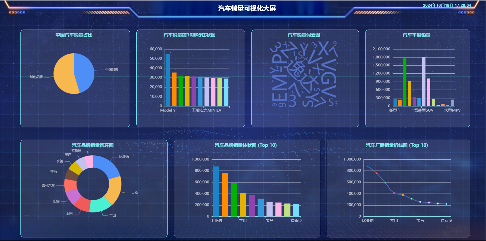

# Visualization-of-large-screens
  使用爬虫获取懂车帝数据并保存到数据库，基于 Flask 和 EChart 实现一个可视化大屏。
  
## 项目介绍
&nbsp;&nbsp;&nbsp;&nbsp;&nbsp;&nbsp;
Dcar 是一个基于 Flask 和 Vue 的懂车帝数据可视化大屏项目。利用爬虫爬取懂车帝的二手车数据存入数据库，然后利用Flask获取爬取后的数据，
同时对数据进行清洗，利用EChart实现可视化处理，
，最终将数据以图表的形式在前端展现出来。

### 项目结构
结构如下：
```
Dcar
├── Chart  # 图表存放目录
├── data  # 数据存放目录
├── dict  # EChart相关js文件
├── flask_Dcar  # Flask 后端
    |─ static  # 静态文件目录
        |─ images  # 图片存放目录
    |─ templates  # 模板存放目录
    |─ flask_Dcar.py  # Flask 程序
├── vue-dcar       # Vue 前端
    |─ public  # 静态文件目录
    |─ src  # 源码目录
        |─ components  # 组件存放目录
            |─ ChartComponent.vue  # 图表组件
            |─ TimeDisplay.vue  # 时间组件
        |─ App.vue  # 入口文件
        |─ main.js 
        |─ styles.css  # 样式文件
├── Dcar_sql.sql  # 数据库文件
├── get_Dcar.py  # 获取数据
├── README.md  # 项目介绍
├── requirements.txt  # 依赖文件
├── selete_Data.py # 数据清洗
└── showChart.py  # 可视化
```

### 安装依赖
首先，安装项目的Python依赖：

```bash
pip install -r requirements.txt
```

### 创建数据库和表
```bash
net start mysql80
mysql -u [username] -p [database_name] < Dcarsql.sql
```

### 定义数据库模型
&nbsp;&nbsp;&nbsp;&nbsp;&nbsp;&nbsp;
在flask_Dcar.py 中，定义一个与 car_sales_copy1 表对应的模型。定义一个 API 路由，返回 car_sales_copy1 表中的数据。

### 启动 Flask 服务器
&nbsp;&nbsp;&nbsp;&nbsp;&nbsp;&nbsp;
初始化 Flask 应用并连接到 MySQL 数据库。
需要修改用户名，密码以及数据库名称（注）
cd 到flask_Dcar.py文件所在目录
```bash
python flask_Dcar.py
```

### 安装 Vue 和依赖
```bash
vue create vue-dcar
####
cd vue-dcar
####
npm install axios echarts echarts-wordcloud@2.0.0 vue-echarts
####
npm run serve
```

### 最终效果
#### 以下是项目的最终效果展示:



